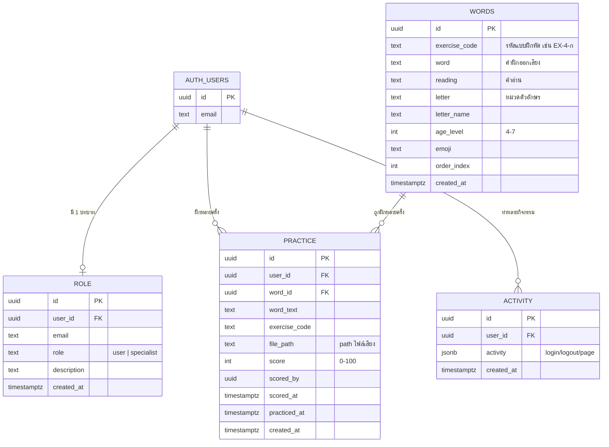

# 🗣️ ระบบเรียนรู้การออกเสียงด้วย AI (AI Pronunciation Learning System)

เว็บไซต์ฝึกออกเสียงภาษาไทยสำหรับ **เด็กที่มีปัญหาทางการออกเสียง (Speech Sound Disorders)
อายุ 4–7 ปี** พร้อมระบบให้คะแนนโดยผู้เชี่ยวชาญ (คุณหมอ/นักแก้ไขการพูด)

---

## 1. ภาพรวมของระบบ

เด็กฝึกออกเสียงผ่านแบบฝึกหัดคำสั้น ๆ ภาษาไทย โดยฟังเสียงตัวอย่างและอัดเสียงของตนเอง
ระบบบันทึกไฟล์เสียงไว้ให้ผู้เชี่ยวชาญรับฟังและให้คะแนน พร้อมรายงานพัฒนาการ

**ผู้ใช้ 2 กลุ่ม**

| บทบาท | ความสามารถ |
|-------|-----------|
| 👧 ผู้ฝึกออกเสียง (`user`) | ลงทะเบียน → เข้าสู่ระบบ → ฝึกออกเสียง (บันทึกไฟล์เสียง) → ดูรายงานการฝึกของตนเอง |
| 👩‍⚕️ ผู้เชี่ยวชาญ (`specialist`) | ลงทะเบียน → เข้าสู่ระบบ → ฟังไฟล์เสียง → ให้คะแนน → จัดการคลังคำ (CRUD) → ดูรายงานผู้ฝึกรายคน |

**ขั้นตอนการทำงาน**

```
ผู้ฝึก (user)      : ลงทะเบียน → login → ฝึกออกเสียง → บันทึกไฟล์เสียง → ดู report ของตนเอง
ผู้เชี่ยวชาญ        : ลงทะเบียน → login → เรียกดูไฟล์เสียง → ให้คะแนน → ดู report ของผู้ฝึก
```

**หน้าเว็บ**

| ไฟล์ | คำอธิบาย | ต้อง login |
|------|----------|:---------:|
| `index.html` | หน้าแรก: hero + แนะนำฟีเจอร์ | – |
| `about.html` | ความสำคัญของการฝึกออกเสียง + งานวิจัยอ้างอิง | – |
| `contact.html` | ประวัติผู้จัดทำ | – |
| `app.html` | แอพฝึกออกเสียง (เลือกอายุ/แบบฝึกหัด/อัดเสียง) | ดูได้ / ฝึกบันทึกต้อง login |
| `game.html` | เกม Phaser 3 เดินเก็บคำฝึกอ่าน | ดูได้ / บันทึกต้อง login |
| `login.html` | เข้าสู่ระบบ / สมัครสมาชิก (เลือก role) | – |
| `management.html` | แดชบอร์ดตาม role (รายงาน / ให้คะแนน / CRUD คำ) | ✅ |

---

## 2. Tech Stack

**Frontend** (deploy บน GitHub Pages — static hosting ฟรี)
- HTML5, **Bootstrap 5.3** (จาก CDN)
- **Google Font: Prompt** เป็นฟอนต์หลัก
- JavaScript (vanilla, ES5-friendly) — ไม่มี build step
- **Phaser 3** — game engine สำหรับ `game.html`
- **Web Speech API** (`speechSynthesis`) — เสียงตัวอย่างภาษาไทย
- **MediaRecorder + Web Audio API** — อัดเสียง + กราฟิกคลื่นเสียงเรียลไทม์

**Backend** (Supabase — free tier)
- **Supabase Auth** — ยืนยันตัวตนด้วยอีเมล (ปิด email confirmation)
- **Supabase Postgres** — ตาราง `role`, `words`, `practice`, `activity` + Row Level Security
- **Supabase Storage** — bucket `recordings` เก็บไฟล์เสียง (private)
- `@supabase/supabase-js` v2 (จาก CDN)

**โครงสร้างไฟล์**

```
.
├── index.html  about.html  contact.html
├── app.html    game.html   login.html   management.html
├── favicon.svg                      # ไอคอนแอป (ลูกโป่งคำพูด + คลื่นเสียง)
├── assets/
│   ├── css/style.css                # ธีมสีสันสดใสสำหรับเด็ก
│   └── js/
│       ├── config.js                # ⚙️ ตั้งค่า Supabase (URL + anon key)
│       ├── supabase-client.js       # init client + auth + activity log
│       ├── layout.js                # header/nav/footer ใช้ร่วมทุกหน้า
│       ├── data-access.js           # โหลดคำ + บันทึกผลฝึก (Supabase/fallback)
│       ├── audio.js                 # TTS + อัดเสียง + waveform
│       ├── words-data.js            # คลังคำสำรอง (auto-generated)
│       ├── app.js  game.js  login.js  management.js
├── db/
│   ├── schema.sql                   # สร้างตาราง + RLS policy + storage
│   └── data.csv                     # คลังคำ 1,600 คำ สำหรับ import เข้า words
├── tools/
│   └── generate_data.py             # สร้าง data.csv และ words-data.js
└── README.md
```

> 💡 **โหมดทดลอง:** หากยังไม่ตั้งค่า Supabase เว็บจะใช้คลังคำสำรอง (`words-data.js`)
> ทำให้เปิด `app.html` / `game.html` ฝึกและฟังเสียงได้ทันที เพียงแต่จะยังไม่บันทึกผลขึ้นระบบ

---

## 3. ER Diagram



แผนภาพแบบข้อความ (เผื่อ Mermaid ไม่แสดง):

```
auth.users (Supabase Auth)
   │ 1        │ 1          │ 1
   │          │            │
   ▼ 1        ▼ *          ▼ *
 role      practice ◄──* words      activity
(บทบาท)   (การฝึก)   (คลังคำ)   (log กิจกรรม)
                │
                └── word_id → words.id (FK)
```

**ความสัมพันธ์**
- `role.user_id`, `practice.user_id`, `activity.user_id` → `auth.users.id`
- `practice.word_id` → `words.id` (FK)
- 1 ผู้ใช้มีได้ 1 บทบาท (unique), ฝึกได้หลายครั้ง, มีกิจกรรมได้หลายรายการ

---

## 4. การติดตั้ง / ตั้งค่า

### 4.1 สร้างโปรเจกต์ Supabase
1. ไปที่ [supabase.com](https://supabase.com) → New project (free tier)
2. **Authentication → Providers → Email** → ปิด **"Confirm email"** (ไม่ต้องยืนยันอีเมล)
3. **SQL Editor** → วางเนื้อหา `db/schema.sql` ทั้งหมด → **Run**
   (สร้างตาราง, RLS policy, ฟังก์ชัน และ storage bucket `recordings`)
4. **Table Editor → `words` → Import data from CSV** → เลือก `db/data.csv`
   (มี 1,600 คำ: 20 ตัวอักษร × 4 ช่วงอายุ × 20 คำ)

### 4.2 เชื่อมต่อ Frontend
แก้ไฟล์ `assets/js/config.js` ใส่ค่าจาก **Project Settings → API**:
```js
window.SUPABASE_CONFIG = {
  SUPABASE_URL: 'https://xxxx.supabase.co',
  SUPABASE_ANON_KEY: 'eyJhbGciOi...',   // anon public key
  RECORDINGS_BUCKET: 'recordings'
};
```
> 🔒 ใช้ **anon public key** เท่านั้น — ความปลอดภัยมาจาก RLS  ห้ามใส่ `service_role` key

### 4.3 รันในเครื่อง (ทดสอบ)
ต้องเสิร์ฟผ่าน HTTP (ไมโครโฟนต้องการ secure context — `localhost` ใช้ได้):
```bash
# Python
python -m http.server 8000
# หรือ Node
npx serve .
```
เปิด `http://localhost:8000`

### 4.4 Deploy บน GitHub Pages
1. push โค้ดขึ้น GitHub repository
2. **Settings → Pages → Source: Deploy from branch → `main` / `root`**
3. เว็บจะอยู่ที่ `https://<username>.github.io/<repo>/`
> GitHub Pages เป็น HTTPS อยู่แล้ว → ไมโครโฟนและ Web Speech API ใช้งานได้

### 4.5 สร้างคลังคำใหม่ (ถ้าต้องการแก้)
แก้คำใน `tools/generate_data.py` แล้วรัน — จะอัปเดตทั้ง `db/data.csv` และ `assets/js/words-data.js`:
```bash
python tools/generate_data.py
```

---

## 5. หมายเหตุด้านคลังคำ
แต่ละแบบฝึกหัด = ตัวอักษรเดียวกัน 20 คำ มีครบ 20 ตัวอักษรที่ใช้บ่อย × 4 ช่วงอายุ = **1,600 คำ**
โดยเรียงจากคำง่าย (อายุ 4 ปี) ไปคำที่ยาว/ซับซ้อนขึ้น (อายุ 7 ปี)
คำส่วนใหญ่เป็นคำจริงพร้อมอิโมจิประกอบ ส่วนตัวอักษรที่มีคำเด็กจำกัด จะเสริมด้วย
"พยางค์ฝึกออกเสียง" (drill) ที่ออกเสียงได้จริงเพื่อให้ครบ 20 คำต่อแบบฝึกหัด

---

## 6. ข้อจำกัด / คำเตือน
- เว็บนี้เป็นเครื่องมือ **เสริม** การฝึก ไม่ใช่การวินิจฉัยหรือทดแทนนักแก้ไขการพูด
- เสียงตัวอย่างใช้ Web Speech API ของเบราว์เซอร์ คุณภาพเสียงไทยขึ้นกับอุปกรณ์/ระบบปฏิบัติการ
- การอัดเสียงต้องใช้บนเบราว์เซอร์ที่รองรับ `MediaRecorder` และอนุญาตไมโครโฟน
